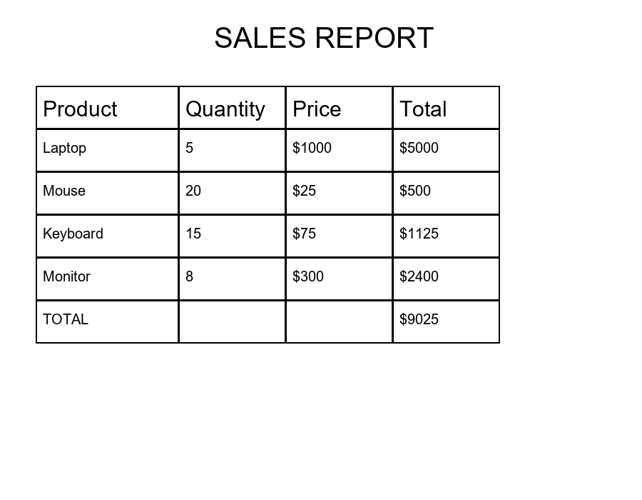
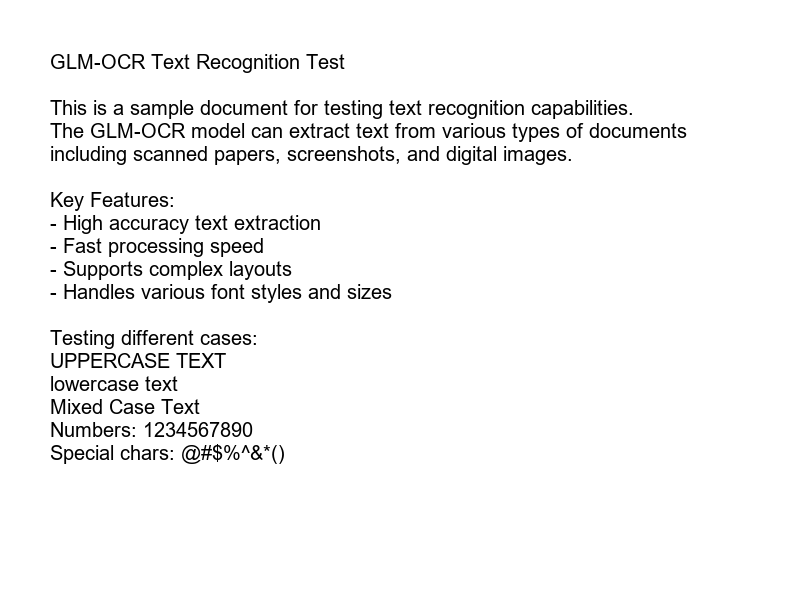
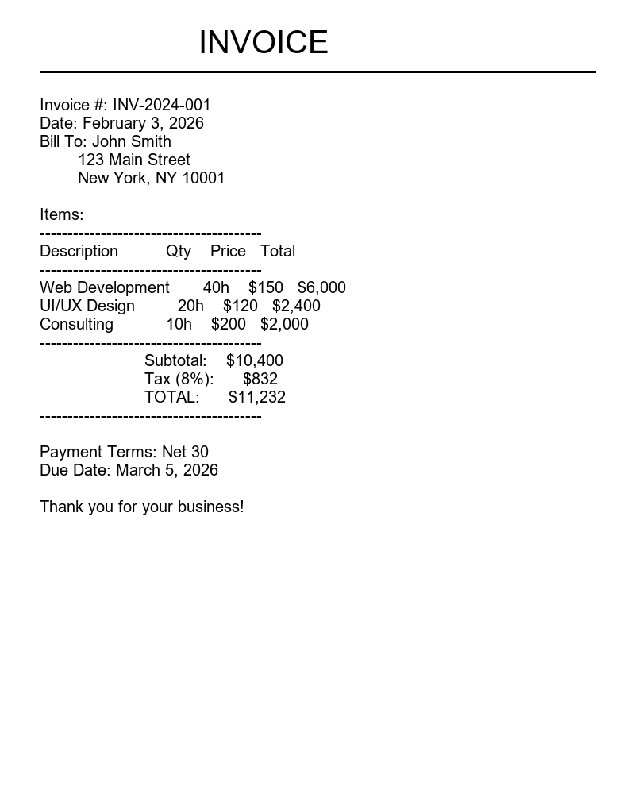
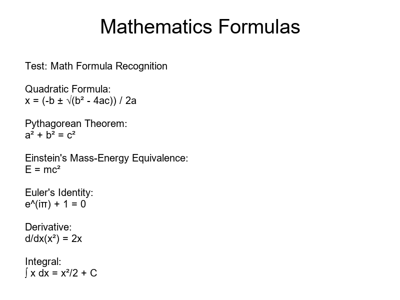
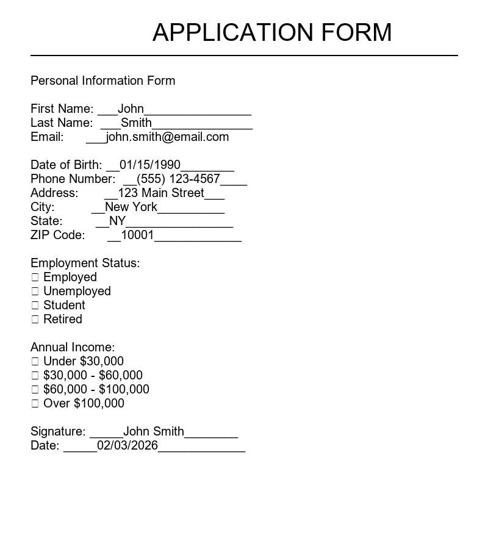
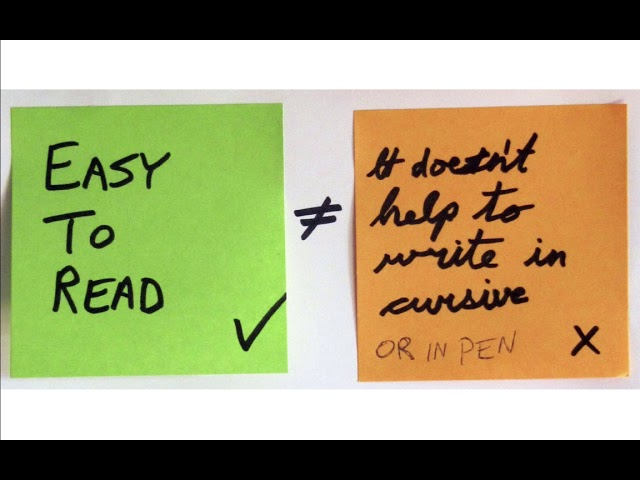
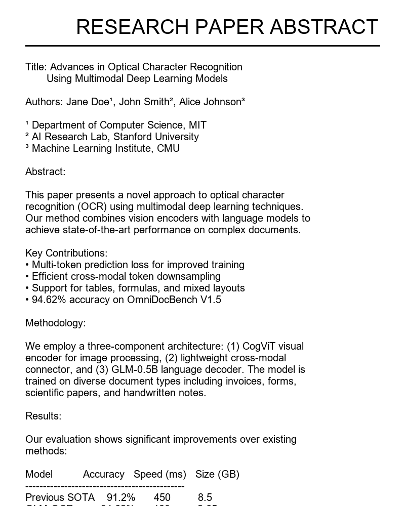

# 🔍 GLM-OCR Suite

> A comprehensive Streamlit application showcasing the powerful capabilities of GLM-OCR, the state-of-the-art multilingual OCR model.

[](https://huggingface.co/zai-org/GLM-OCR)
[](LICENSE)
[](https://streamlit.io)
[](https://www.python.org/downloads/)

<p align="center">
  
</p>

## ✨ Features

- 🏆 **State-of-the-Art**: #1 on OmniDocBench V1.5 (94.62 score)
- 🌍 **Multilingual**: Chinese, English, French, Spanish, Russian, German, Japanese, Korean, and more
- ⚡ **Fast & Efficient**: 0.9B parameters, ~2.5GB VRAM, GPU accelerated
- 🎯 **8+ Specialized Tasks**: Text, tables, formulas, invoices, forms, handwriting, documents, PDFs
- 📊 **Smart Rendering**: HTML tables, JSON trees, LaTeX formulas, Markdown
- 🚀 **Auto-Detection**: Automatically selects optimal extraction method for each sample
- 💾 **Persistent Model**: Model stays loaded in GPU memory for instant processing
- 📄 **PDF Support**: Process multi-page PDFs (up to 100 pages, 50MB)

## 🎯 Supported OCR Capabilities

| Capability | Output Format | Use Case |
|-----------|---------------|----------|
| 📄 Text Recognition | Plain Text | General text extraction from any image |
| 📊 Table Recognition | HTML | Structured table data with rows/columns |
| 🧾 Invoice/Receipt | JSON | Billing info (invoice #, items, totals, dates) |
| 🔢 Math Formulas | LaTeX | Mathematical equations and formulas |
| 📋 Form Fields | JSON | Form data (fields, values, checkboxes) |
| ✍️ Handwriting | Text | Handwritten notes, letters, sticky notes |
| 📚 Document Understanding | Markdown | Comprehensive document analysis |
| 📄 PDF Processing | Text/JSON/HTML | Multi-page PDF documents |

## 🚀 Quick Start

### Prerequisites

```bash
# Install dependencies
pip install -r requirements.txt

# Install latest transformers (required for GLM-OCR)
pip install --upgrade git+https://github.com/huggingface/transformers.git

# For PDF support (optional)
pip install pdf2image
# Also install poppler: https://github.com/oschwartz10612/poppler-windows/releases/
```

### Run the Application

**Two-Process Setup** (Recommended):

```bash
# Terminal 1: Start model server (loads model on GPU)
python server.py

# Terminal 2: Start Streamlit app (after model loads)
streamlit run app.py --server.port 8507
```

**All-in-One** (For quick testing):

```bash
python server.py &
streamlit run app.py --server.port 8507
```

### Access

Open your browser to: **http://localhost:8507**

## 📖 How to Use

1. **Select a Sample**: Click any sample image from the gallery
2. **Auto-Process**: The app automatically detects the best extraction method and processes immediately
3. **View Results**: Results are beautifully rendered based on type:
   - **Tables**: Rendered HTML tables
   - **JSON**: Syntax-highlighted code + interactive tree
   - **LaTeX**: Rendered mathematical formulas
   - **Text**: Markdown and code views
4. **Download**: Save results in appropriate format (HTML, JSON, TXT)

## 🖼️ Included Samples

The repository includes 7 high-quality sample images:

| Sample | Task | Description |
|--------|------|-------------|
|  | Text Recognition | Mixed text styles and cases |
|  | Table Recognition | Sales report with structured data |
|  | Invoice Extraction | Professional invoice with line items |
|  | Math Formulas | Common mathematical equations |
|  | Form Recognition | Application form with fields |
|  | Handwriting | Real sticky notes with different styles |
|  | Document Analysis | Research paper abstract |

## 🏗️ Architecture

### Model Server (`server.py`)
- **FastAPI-based** REST API
- Loads GLM-OCR model **once** on startup
- Keeps model in **GPU memory** for fast inference
- Serves predictions via HTTP endpoint
- **No reload** between requests

### Streamlit App (`app.py`)
- Clean web interface with gallery view
- Auto-detection of optimal extraction method
- Smart rendering based on output type
- No model loading (uses server API)
- **Instant processing** - one click!

### PDF Processor (`pdf_processor.py`)
- CLI tool for batch PDF processing
- Converts PDF pages to images
- Processes each page with GLM-OCR
- Saves combined results

## 📊 Performance

Tested on NVIDIA GPU (cuda:0):

- **Average**: ~6.5s per image
- **Fastest**: 2.76s (handwriting)
- **Throughput**: 1.86 pages/s (PDF), 0.67 img/s (images)
- **VRAM**: ~2.5GB
- **Model Size**: 0.9B parameters (~2.65GB)

## 🔧 API Reference

### Health Check

```bash
GET http://localhost:8508/
```

Response:
```json
{
  "status": "ok",
  "model": "zai-org/GLM-OCR",
  "model_loaded": true,
  "device": "cuda:0"
}
```

### Predict

```bash
POST http://localhost:8508/predict
```

**Parameters:**
- `image`: Image file (multipart/form-data)
- `prompt`: Task prompt string

**Example:**
```bash
curl -X POST http://localhost:8508/predict \
  -F "image=@samples/1_text_recognition.png" \
  -F "prompt=Text Recognition:"
```

**Response:**
```json
{
  "success": true,
  "output": "extracted text content here",
  "prompt": "Text Recognition:"
}
```

## 💡 Advanced Usage

### Custom JSON Schema Extraction

Define your own schema for structured extraction:

```python
prompt = """Please extract in JSON format:
{
  "title": "",
  "author": "",
  "date": "",
  "sections": [
    {"heading": "", "content": ""}
  ],
  "keywords": []
}"""
```

### PDF Batch Processing

```bash
# Process PDF via command line
python pdf_processor.py document.pdf "Text Recognition:" 10

# Process with table extraction
python pdf_processor.py report.pdf "Table Recognition:"

# Extract invoices from PDF
python pdf_processor.py invoices.pdf "Extract invoice data in JSON format..."
```

### Custom Prompts

```python
# Entity extraction
"Extract all person names, dates, and locations:"

# Code extraction
"Extract all code blocks and identify programming languages:"

# Multi-step extraction
"First extract tables, then summarize the key findings:"
```

## 🌟 About GLM-OCR

Developed by [Zhipu AI (zai-org)](https://huggingface.co/zai-org), GLM-OCR represents a breakthrough in efficient, high-quality OCR:

- **Compact**: Only 0.9B parameters vs 10B+ for competitors
- **Accurate**: Matches GPT-4V performance on OCR tasks
- **Fast**: Optimized for production deployment (VLLM, SGLang support)
- **Versatile**: Handles 8+ different document types
- **Multilingual**: 8+ languages including CJK
- **Open Source**: MIT License

### Key Capabilities

- ✅ **Text Recognition**: Printed text, various fonts and sizes
- ✅ **Table Extraction**: HTML structure with headers and data
- ✅ **Formula Recognition**: LaTeX output for math equations
- ✅ **Handwriting**: Cursive, print, and mixed styles
- ✅ **Information Structuring**: JSON extraction with custom schemas
- ✅ **Multilingual**: Works across 8+ languages
- ✅ **PDF Processing**: Multi-page documents up to 100 pages

### Resources

- 🤗 **HuggingFace Model**: https://huggingface.co/zai-org/GLM-OCR
- 📚 **Documentation**: https://docs.z.ai
- 💻 **GitHub (Official)**: https://github.com/zai-org/GLM-OCR

## 📦 Repository Structure

```
glm-ocr-suite/
├── app.py                      # Main Streamlit application
├── app_with_pdf.py             # Streamlit app with PDF support
├── server.py                   # FastAPI model server
├── pdf_processor.py            # CLI PDF processing tool
├── requirements.txt            # Python dependencies
├── README.md                   # This file
├── LICENSE                     # MIT License
└── samples/                    # Sample images for testing
    ├── 1_text_recognition.png
    ├── 2_table_recognition.png
    ├── 3_invoice_receipt.png
    ├── 4_math_formulas.png
    ├── 5_form_recognition.png
    ├── 6_handwriting_sample.png
    └── 7_document_understanding.png
```

## 🎨 Screenshots

### Gallery View
The app displays all samples in a gallery with one-click processing.

### Table Recognition
Tables are extracted as HTML and rendered beautifully in the browser.

### JSON Extraction
Invoices and forms are extracted as structured JSON with an interactive tree viewer.

### LaTeX Rendering
Math formulas are displayed as rendered equations using Streamlit's built-in LaTeX support.

## 🛠️ Technical Details

### Model
- **Name**: zai-org/GLM-OCR
- **Parameters**: 0.9B
- **Architecture**: CogViT encoder + GLM-0.5B decoder
- **Training**: Multi-token prediction + RL fine-tuning
- **License**: MIT

### Performance Benchmarks
- **OmniDocBench V1.5**: 94.62 (#1 rank)
- **Text Recognition**: SOTA
- **Table Recognition**: SOTA
- **Formula Recognition**: SOTA
- **Information Extraction**: SOTA

## 🤝 Contributing

Contributions are welcome! Feel free to:

- 🐛 Report bugs
- 💡 Suggest new features
- 📝 Improve documentation
- 🎨 Add new sample images
- ⚡ Optimize performance

## 📜 License

This project is licensed under the MIT License - see [LICENSE](LICENSE) for details.

The GLM-OCR model is also under MIT License - see the [model card](https://huggingface.co/zai-org/GLM-OCR) for details.

## 🙏 Acknowledgments

- [Zhipu AI](https://huggingface.co/zai-org) for developing GLM-OCR
- [HuggingFace](https://huggingface.co) for model hosting
- [Streamlit](https://streamlit.io) for the web framework
- [FastAPI](https://fastapi.tiangolo.com) for the API server

## 📧 Support

- **Issues**: Open an issue on this repository
- **Model Questions**: Visit the [GLM-OCR model card](https://huggingface.co/zai-org/GLM-OCR)
- **Documentation**: https://docs.z.ai

---

<p align="center">
  <b>⭐ If you find this project useful, please star it on GitHub! ⭐</b>
</p>

<p align="center">
  Built with ❤️ using <a href="https://huggingface.co/zai-org/GLM-OCR">GLM-OCR</a>, Streamlit, and FastAPI
</p>
